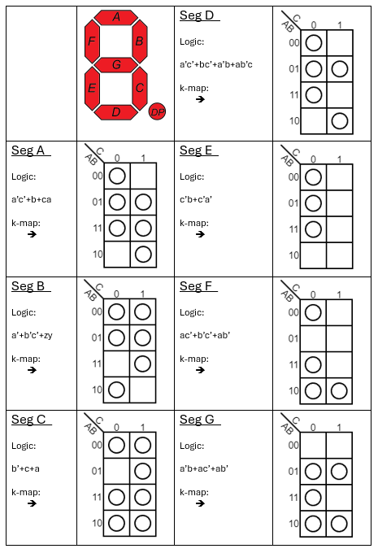
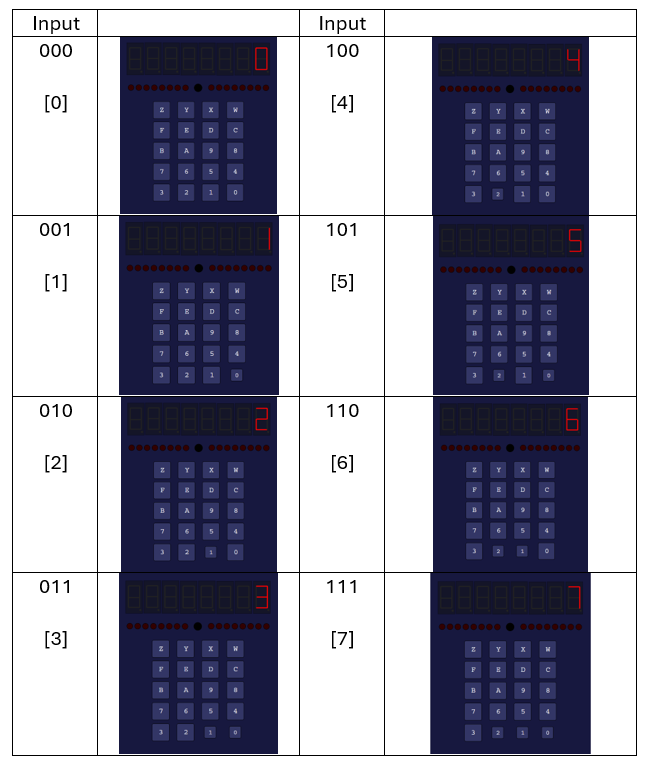

# 3 Bit to 7 Segment Display Converter

## Purpose

This program is designed to be utilized when a 3 bit input is utilized and a numerical output is desired on a single 7 segment display. Perhaps not very practical but none the less interesting and may be utilized later.

## Design

This program was designed fully from scratch utilizing k-maps to find the boolean logic equations that can be used to determine when each segment should be on. The following k-maps and logic equations were used for every segment.

Within the actual program, we utilize 3 push buttons to act as A,B, and C logic values and utilize one of the 7-segmented displays as our output.

## Verification

